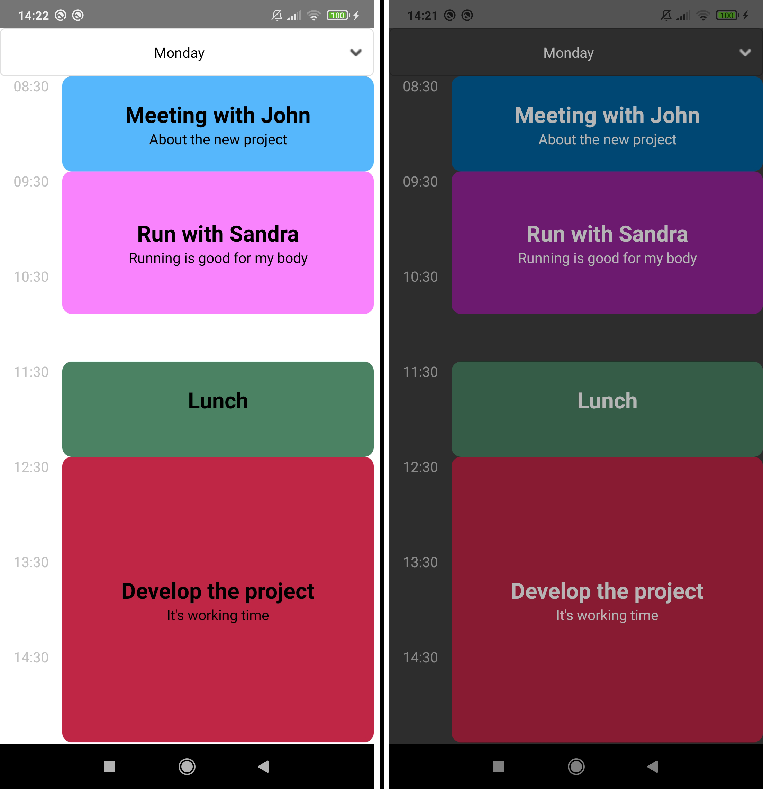

#  Schedule React-Native component.
__________________________________________

This is a simple week schedule component in React-Native. You can add appointments with their title, subtitle, day of week, start time, end time and color.



# Install

It's very easy to install it. Run this commmand in your terminal :
```
npm install rn-simple-schedule
```

# Exemple

```javascript
import React from 'react';
import Schedule from 'rn-simple-schedule';

const data = [
    {
      Title: 'Meeting with John',
      Subtitle: 'About the new project',
      DayIndex: 1, //Monday
      StartTime: '08:30',
      EndTime: '09:30',
      Color: "#56b7fc"
    },
    {
      Title: 'Stay at home',
      Subtitle: 'Stay cool',
      DayIndex: 6, //Saturday
      StartTime: '08:30',
      EndTime: '18:30',
      Color: "#00ff67"
    }
  ];

export default function App() {
  return (
    <Schedule 
      lang='en'
      data={data} 
      rowSize={100}
      minHour={8}
      minMinute={30}
      numberOfRows={10}
      canRemove={false}
      darkMode={false}
      onAppointmentRemoved={(app)=>console.log(app)}
      onSelectedDayChanged={(dayIndex)=>console.log(dayIndex)}
    />
  );
}
```

# Features
* Customizable appointments colors
* Adjuste size of an hour
* Set the first hour to show
* Choose the number of hours (rows) to show
* Choose the language (english or french)
* Popup to remove appointment (disablable)
* Dark mode style (is auto managed by React-Native 0.63)

# Props

None of the props are required !

|Prop|Description|Default value|Type|
|--|--|--|--|
| data | Array of appointments objects | ```Empty Array``` | Array |
| rowSize | Height of an hour cell | ```100``` | number |
| minHour | First hour to show | ```8``` | number |
| minMinute | Minutes of the first hour to show | ```30``` | number |
| numberOfRows | Number of hours (rows) to show | ```13``` | number |
| canRemove | If true, a popup to remove the selected appointment , will appear, on press on it. | ```true``` | boolean |
| darkMode | Enable dark mode style (is auto managed by React-Native 0.63 or higher) | ```Depending on device setting``` | boolean |
| lang | Language used by the component | ```en``` (english) | string |
| onAppointmentRemoved | Return a function triggered whenever user remove an appointement. | ```null``` | function |
| onSelectedDayChanged | Return a function triggered whenever selected day changed. | ```null``` | function |

# Data array of appointments objects
The ```data``` prop is an Array that must contains appointments objects with following format :

```javascript
[
    {
      Title: 'Meeting with John',
      Subtitle: 'About the new project',
      DayIndex: 1,
      StartTime: '08:30',
      EndTime: '09:30',
      Color: "#56b7fc"
    }
]
```

**Appointment object**

| Key | Description | Type | Required
|--|--|--|--|
| Title | Title of the appointment | string | Required
| Subtitle | Text under the title | string | No required
| DayIndex | Day index of appointment <br> 1 : Monday<br> 2 : Tuesday <br> 3 : Wednesday <br>... | number | Required
| StartTime | Start time of the appointment with format: ``` hh:mm ``` | string | Required
| EndTime | End time of the appointment with format:  ``` hh:mm ``` | string | Required
| Color | Background color of the appointment | ColorValue | No required

# Language

The ```lang``` prop allows to choose the language of component.

Values of this prop :

* ```en``` : English language
* ```fr``` : French language

__________________________________________________

**Author**

**Admandev**

* [Web site](https://www.admandev.fr)
* [Facebook](https://www.facebook.com/AdmanDev/)
* [Twitter](https://twitter.com/AdmanDev)
* [YouTube](https://www.youtube.com/c/ADMANDev)

**Donation**

If you like my work, you can [make a donation](https://www.paypal.com/donate/?cmd=_donations&business=adman.software%40gmail.com&currency_code=USD&amount=02.00&source=url). 

**Licence**
 
 Released under the MIT License.